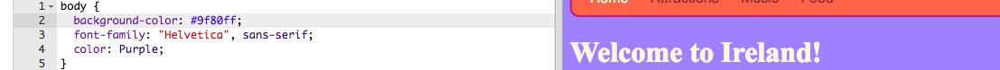
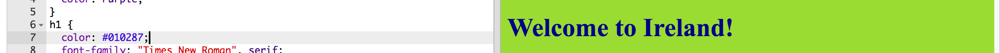

1. Take a look at your **stylesheet**. That's the file that has **.css** in the name.
2. Inside the CSS rules for `body`, set the background colour to
   ```
        background-color: #7B68EE;
   ```

   * If you are using a Mac, the **\#** is typed by holding the **alt** key and the number **3** key together.
3. When you click Run, your website should have a blue/purple background. 
As you have seen, you can type in many different colour names as words and the browser will recognise them. But a more common way to set colours is to use a code like the one above, called a **HEX** code.
4. Try it yourself: Go to dojo.soy/COLOURS-LIST-TODO and choose a colour for your website. But instead of typing the name of the colour, type in the HEX code.
6. HEX codes allow you to mix any colour, even if it's not on any list of colours. Try making up your own colour code
   * The code must start with a `#`. This tells the browser that it is a HEX code instead of a colour name.
   * The rest of the code is made up of six characters. They can be  any number from 0-9 and any letter from A-F.
7. How does it work? Every colour is made by mixing three colors: **Red**, **Green**, and **Blue**. You may have seen this written down as **RGB**. Each of these colours is represented by two of the six digits in your code. The higher the number, the more of the colour there is.
8. What's going on with those letters?! **Hexadecimal** is a special way of counting that uses the letters A-F as **extra digits** higher than 9. This makes the numbers shorter to write. Colours go from 0 up to 255, or in Hexadecimal: from 00 up to FF.
 * If you wrote the colour `#9ADC32` using plain RGB numbers, it would be `154,205,50`.
8. You don't need to worry too much about learning to count with Hexadecimal numbers. There are plenty of colour picking tools that help you get the HEX code for any colour you want. 
9. Go to dojo.soy/W3-SCHOOLS-COLOUR-PICKER-TODO and try out the colour picker pictured above to choose some HEX colour codes to use on your website.
6. Fun exercise: Take your six-digit date of birth and put a `#` symbol in front to make your own unique personal colour code! Try it out in your stylesheet–what colour did you get? 


