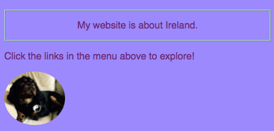

1. Let's jazz up the homepage a bit! Go to _index.html_ and add the following **attribute** to the first paragraph tag:
    ```html
        <p id="myCoolText">
            My website is about Ireland.
        </p> 
    ```
    The **id** is a name you give to **identify** this particular element. No two elements on a page should ever have the same **id**.

2. Now go to your stylesheet and add the following code
    ```css
        #myCoolText {
            border: 2px ridge #add8e6;
            padding: 15px;
            text-align: center;
        }
    ```
    Here you're using an **ID selector**. You can tell because of the **#** in front of it.
    * The name should _exactly_ match the name you put in the element's **id** attribute
    

3. By giving an element an **id** and using an **ID selector** in your stylesheet, you can make _unique_ CSS rules that just apply to that one specific thing on your website. Let's do one for the **body** of the homepage. Go to index.html and add an **id** to the **body** tag.
    ```html
        <body id="frontPage">
    ```

6. In the stylesheet, add CSS rules for the body of the homepage.
    ```css
        #frontPage {
            background: #48D1CC;
            background: linear-gradient(#fea3aa, #f8b88b, #faf884, #baed91, #baed91, #b2cefe, #f2a2e8, #fea3aa);
        }
    ```
    You just used a **gradient**! You can make lots of different effects with gradients. If you want to learn more, go to [dojo.soy/html-css-gradients](https://www.w3schools.com/css/css3_gradients.asp).

7. Try giving another element an **id** and styling that element using the id selector with **#** as above. How about making the picture of Tito have a **border-radius** of _100%_ so that it's fully rounded? Any other pictures on the website will stay the same as they are.


